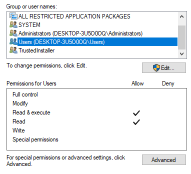
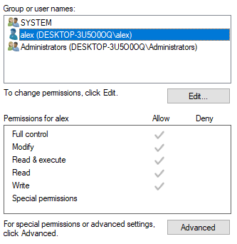

# Writing a Antivirus-Bypassing Metasploit Module for Windows Local Privilege Escalation Exploit

In May 2019, a security researcher by the name "SandboxEscaper" publicly released three 0-day Windows LPE (Local Privilege Escalation) exploits, allowing malicious attackers to gain SYSTEM privileges on Windows 10 systems as unprivileged users. This post will describe the vulnerability, consider its impact and remediations, and explain the techniques used to write an antivirus-bypassing metasploit module for the exploit.

## The Vulnerability

One of the 0-days released utilizes a bug in legacy windows task scheduler (schtasks.exe) to gain arbitrary file permission modification.

The task scheduler is a component in Windows that allows scheduling programs or scripts to be launched at a set schedule. The usage of this tool has changed throughout different versions of Windows, however Microsoft still maintains limited backwards compatability to legacy task scheduler formats. Specifically, the tasks used in Windows XP or older versions of Windows `.job` files is of interest.

Normally, creating tasks using `.job` files is not supported in Windows 10 anymore. However, this exploit utilizes a version of `schtasks.exe` which is able to register a `.job` task into Windows 10's task scheduler.

It turns out the properties of the `.job` file is not checked during task registration. Additionally, the Task Scheduler grants tasks full read/write permissions to the tasks - and unsurprisingly, the Task Scheduler has SYSTEM privileges. So, if we replace the `.job` file with a hardlink to another file we are interested in, then the Task Scheduler would grant read/write privileges to that file for us to freely modify when the registration of a legacy `.job` task occurs. Because the Task Scheduler has SYSTEM privileges, this will work with any file, including files in `C:\\Windows\\System32`.

Using SandboxEscaper's exploit, we can try modifying a file - `C:\\Windows\\System32\\license.rtf`. The permissions of this file before are:



The permissions after are:



## Impact and Remediations

This vulnerability is a very potent LPE exploit due to its ease of use and consistency. The best remediation is to update Windows, since Microsoft has issued micropatch bug fixes for this vulnerability.

## Weaponizing Through Metasploit - LPE to System Administrator Shell

With its ease of use and potency, writing a metasploit module would be a great way to utilize the exploit in engagements. However as of now, the exploit only allows arbitrary file permission changes - how can we convert this into a SYSTEM shell? The answer is in `C:\\Windows\\System32`. Because we can gain control of any file in System32, we can simply write a `.dll` there, and when the `.dll` is triggered, our code will be executed. To trigger the loading of such a `.dll`, the technique described in [this](https://googleprojectzero.blogspot.com/2018/04/windows-exploitation-tricks-exploiting.html) post was used. Now we can simply drop a reverse shell `.dll` payload, and trigger the dll to gain a SYSTEM shell.

Now it's time to write the module. Metasploit modules are written in `Ruby`. Going into this, I had no prior knowledge in Ruby, however being an experienced programmer and knowing python, Ruby syntax was easy to pick up.

In a metasploit module, the class of the module must be specified. This vulnerability is a local privilege escalation, so naturally, the exploit is a local exploit.

```ruby
class MetasploitModule < Msf::Exploit::Local
```

The metasploit module allows access to various functions defined by metasploit's framework, including `write_file` and `cmd_exec`. Using just these two functions, we can deliver the entire exploit (although admittedly, there are likely better functions and better metasploit module practices). First of all, let's define the exploit chain and the necessary components.

1. Drop `schtasks.exe`
2. Drop `.job` file
3. Drop `diaghub.exe`
4. Drop executable that will trigger the LPE exploit chain - `polarbear.exe`
5. Drop reverse shell dll payload
6. Use `polarbear.exe`, `schtasks.exe`, and `.job` file to change permissions of `C:\\Windows\\System32\\license.rtf`
7. Copy reverse shell dll payload to license.rtf with `runas` unprivileged user
8. Start reverse shell listener
9. Trigger diaghub on license.rtf to execute reverse shell.

The necessary components are defined in steps 1 through 5. Because these files are dropped onto the target filesystem, some anti-virus bypassing techniques are used, although an alternative can be to use process injection, but this method is easier :)

Numerous extremely simple techniques yet incredibly effective are described [here](https://wikileaks.org/ciav7p1/cms/files/BypassAVDynamics.pdf). The general idea is that antivirus static analysis largely involves signature or pattern matching with previously known malicious bytes. This is easily bypassable with packing or encryption. To combat runtime decryption, antivirus would dynamically analyze binaries by executing them within a sandbox, and looking for malicious signatures in memory. However, antivirus analysis must be fast, so they usually have timeouts for the binary. So, if we simply have a big loop in our executable, then the antivirus won't ever see our malicious code being decrypted in memory. Antivirus defeated!

Now we have all the information we need for the exploit. First we drop all the files onto the filesystem.

```ruby
write_file("Bear.job", bearjob_bytes)
write_file("polarbear.exe", polarbear_bytes)
write_file("schtasks.exe", schtasks_bytes)
write_file("diaghub.exe", diaghub_bytes)
write_file("met.dll", dll)
```

Then, we execute the LPE exploit.

```ruby
cmd = "polarbear C:\\\\Windows\\\\System32\\\\license.rtf " + uname + " " + pw
res = cmd_exec(cmd)
```

Then, we copy over the reverse shell dll. One thing to note in this step is that we need to use `runas` with an unprivileged user. The metasploit code for this can be seen [here](https://rapid7.github.io/metasploit-framework/api/Msf/Post/Windows/Runas.html).

```ruby
write_file("cp.bat", "copy " + tempdir + "\\met.dll " + "C:\\Windows\\System32\\license.rtf\"")
do_runas_command
```

Finally, we trigger the reverse shell and win!

```ruby
cmd_exec("diaghub C:\\\\ProgramData\\\\license.rtf")
```


The code can be found [here](https://github.com/PolitoInc/Polarbear-LPE-Metasploit-Module).